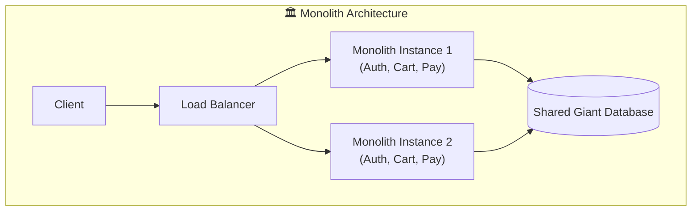
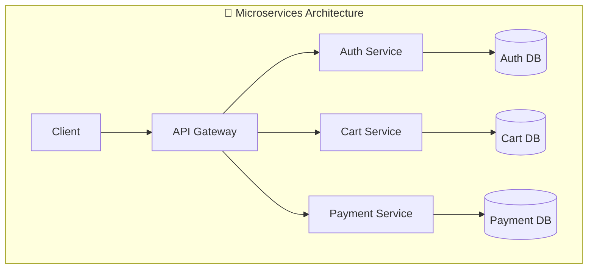
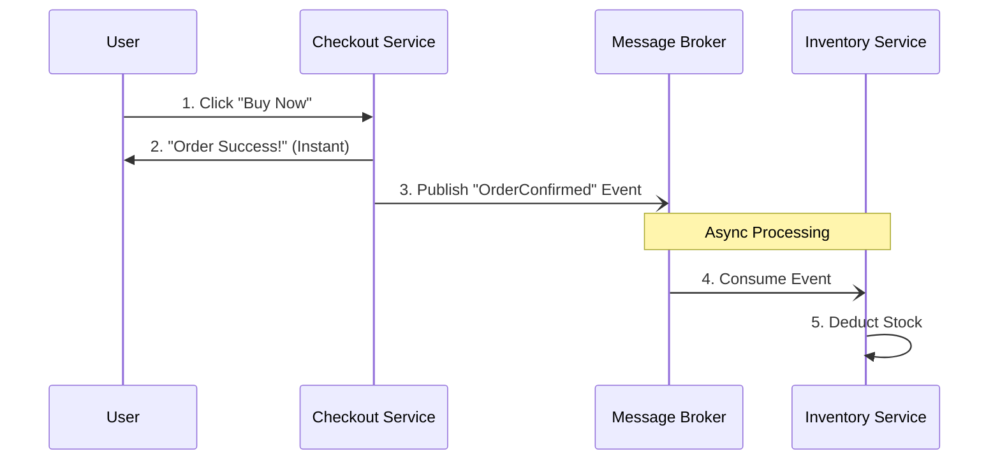

# 🚀 Microservices Architecture Deep Dive

This note breaks down the **Monolith vs. Microservices** debate, real-world communication patterns, and how to manage the code.

---

## 🏗️ 1. The Big Picture: Monolith vs. Microservices

### 🏛️ Monolithic Architecture
A Monolith is a unified software application where everything (e.g., UI, Business Logic, Data Access) is tightly coupled in a single codebase and deployed as a single process.

**The Scalability Myth:**
> 💡 *Misconception:* A Monolith can only run on a single machine.
> 🛠️ *Reality:* You can horizontally scale a Monolith by running multiple instances of the entire application across different servers, fronted by a Load Balancer!

#### Why start with a Monolith?
* **Simpler Mental Model:** Easier for a small, cohesive team to build, test, and deploy. Everything is in one place.
* **Speed of Execution:** No network overhead. Calling the "Payment" function from the "Checkout" module is a blazing fast, in-memory function call.
* **Easy E2E Testing:** Setting up the environment is straightforward; spin up one app, one DB.

#### When does it hurt?
* **The "Spaghetti" Effect:** As the team grows, code becomes tangled. A new engineer needs to understand the entire massive system just to make a small change.
* **Blast Radius:** If a memory leak occurs in the `Reporting` module, it crashes the *entire* server, taking down the `Checkout` module with it!
* **Deployment Bottleneck:** Changing a simple typo in an email template requires rebuilding and redeploying the whole multi-gigabyte application.

##
### 🧩 Microservices Architecture
Microservices break down an application into smaller, independent services aligned with **business domains** (e.g., User Profile, Order Management, Notifications).

**The "Micro" Myth:**
> 💡 *Misconception:* Microservices mean tiny servers with just 100 lines of code.
> 🛠️ *Reality:* "Micro" refers to the **bounded context**, not the codebase size. A microservice owns a specific business capability and its own data! If two services are constantly chatting synchronously, they should probably be merged back into one service.

#### Why move to Microservices?
* **Fault Isolation:** If the `Recommendation` service crashes, users can still check out. Partial degradation is always better than a full outage.
* **Independent Scalability:** Black Friday sale? Scale up the `Checkout` service 10x while keeping the `User Profile` service at 1x.
* **Tech Freedom:** Use Java/Spring Boot for enterprise payments, Go for high-throughput messaging, and Python for the recommendation engine.
* **Team Velocity:** Smaller teams can own their service end-to-end (code, deploy, monitor) without waiting for global release trains.

---

## 🖼️ Architectural Visualization

---

## 🗣️ 2. How Do They Talk? (Communication Patterns)

When you split the monolith, simple in-memory function calls become complex network calls. Communication is the hardest part of distributed systems!

### A. Synchronous (HTTP / REST / gRPC)
One service calls another and **waits** for the response.
* **Pros:** Simple, understandable, easy to reason about.
* **Cons:** Cascading failures. If `Service A` calls `Service B` and `B` is slow, `A` becomes slow. High coupling in availability.
* **Real-World Use:** User requests their profile data to render the homepage.

### B. Asynchronous (Message Brokers / Event-Driven)
Services communicate by firing events into a broker (like Kafka or RabbitMQ) and moving on immediately.
* **Pros:** Highly decoupled. If the `Email` service is down, the `Checkout` service still succeeds. The broker holds the message until the `Email` service comes back online.
* **Cons:** Harder to trace requests. "Eventual Consistency" means data might take a few milliseconds (or seconds) to update across the system.
* **Real-World Use:** An order is placed. Fire an `OrderPlaced` event. The `Inventory`, `Email`, and `Shipping` services consume it at their own pace.

### C. The Service Mesh (The Silent Helper)
Managing retries, timeouts, security (mTLS), and routing across 100s of services is a nightmare.
* **Solution:** A **Service Mesh** (like Istio or HashiCorp Consul) deploys a small proxy (sidecar) next to every service. The services just talk to `localhost`, and the proxy handles all the complex, secure network logic invisibly.

---

## 🧱 3. Essential Microservices Patterns

To truly succeed with Microservices in production, you must implement specific architectural patterns to handle distributed system complexities:

### 1. API Gateway Pattern
Instead of clients calling 50 different microservices directly, they call a single entry point: the **API Gateway**.
* **What it does:** Routes requests, handles authentication (JWT validation), rate limiting, and SSL termination.
* **Why it's needed:** Without it, the frontend UI has to manage URLs and network logic for dozens of services, and any internal service renaming would break the client.

### 2. Circuit Breaker Pattern
Network calls fail. If Service A calls Service B and B is unresponsive, A will wait until a timeout. If 1,000 requests happen, A exhausts its own threads waiting for B, taking down A as well!
* **Solution:** A Circuit Breaker monitors failures. If Service B fails 5 times in a row, the circuit "opens." Service A immediately returns an error (or fallback cache) without even trying to call B, giving B time to recover. Once B is healthy, the circuit "closes" and traffic resumes.

### 3. Saga Pattern (Distributed Transactions)
In a monolith, you use standard ACID Database Transactions. In Microservices, your data spans multiple DBs. 
* **The Problem:** How do you rollback an order if the `Inventory` service succeeds but the `Payment` service fails?
* **Solution (Saga):** A sequence of local transactions. If one step fails, the Saga executes **Compensating Transactions** to undo the previous steps (e.g., if Payment fails, trigger a `Refund` or `RestockInventory` event).

### 4. CQRS (Command Query Responsibility Segregation)
* **The Problem:** Writing data is complex (needs validation), but reading data needs to be incredibly fast. 
* **Solution:** Separate the "Write" operations (Commands) from the "Read" operations (Queries). Often, this involves writing to a relational DB (like PostgreSQL) and then asynchronously syncing the data to an optimized read-replica or search index (like Elasticsearch or Redis) for lightning-fast reads.

---

## 📂 4. Managing the Code: Monorepo vs. Polyrepo

Where do you store the source code for all these independent microservices?

| Approach | What is it? | Pros | Cons | When to use? |
| :--- | :--- | :--- | :--- | :--- |
| **Monorepo** | All services live in a single Git repository. | - Easy code sharing (utils, proto files). - Atomic commits across services. - Single source of truth. | - Repo becomes massive. - CI/CD pipelines become highly complex to figure out "what changed". | Companies like Google/Meta use massive custom tools. Great for smaller companies starting out. |
| **Polyrepo** | Each service gets its own Git repository. | - True isolation (code, deployment, access). - Smaller repos, faster clones. - CI is simple and focused. | - Hard to share code (needs published internal packages). - Cross-cutting changes are painful. | Large distributed teams where services are fully decoupled. |

---

## 🌧️ 5. The Dark Side of Microservices (Downsides)

Microservices solve organizational scaling problems, but they create **Distributed Systems** problems. Always remember this tradeoff!

1. **Observability Nightmare:** A request fails. Did it fail in the API Gateway, Auth, Product, or DB? You *must* implement distributed tracing (e.g., Jaeger, Zipkin, correlating logs via a unique `trace_id`) and centralized logging (e.g., ELK stack).
2. **Data Consistency:** You can no longer do simple SQL `JOIN`s across tables because the data lives in different databases. 
3. **Network Latency & Failures:** Networks are unreliable. 
4. **Testing is Hard:** You can't easily spin up the entire system on a single laptop to test a feature. You rely heavily on Contract Testing (e.g., Pact).

---

## 🎯 6. TL;DR - System Design Interview Cheat Sheet

* Choose **Monolith** when: Small cohesive team, early-stage startup (validating product-market fit), low latency requirements.
* Choose **Microservices** when: Large scale application, large team needing independent deployment velocity, different scaling needs for different features.
* **Pro-Tip for Interviews:** Don't just say *"Microservices scale better."* Say *"Microservices allow independent scaling of specific business components and decouple deployment lifecycles, at the cost of distributed system complexity."*

---
**🔗 References & Further Reading**
* 🎥 [What is a monolith vs Microservice Architecture](https://www.youtube.com/watch?v=qYhRvH9tJKw)
* 🎥 [Transitioning to Microservices](https://www.youtube.com/watch?v=rv4LlmLmVWk)
