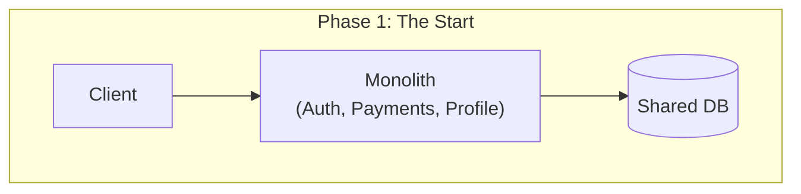
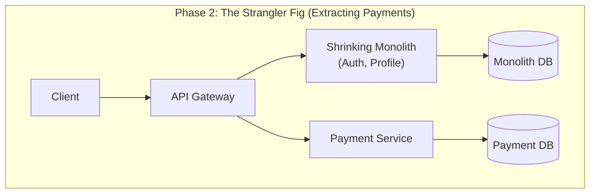

# 🚀 02: Migrating from Monolith to Microservices

So, you have a massive Monolith and it's starting to hurt. When do you break it apart? And more importantly, *how* do you break it apart without taking down the entire business? 

This guide covers the philosophy, the strategies (like the Strangler Fig pattern), and the mandatory infrastructure needed to successfully migrate to a microservices architecture.

---

## 🤔 1. The Trigger: When should you migrate?

**The Golden Rule:** You don't move to microservices because your *traffic* scaled. You move because your *team* scaled.

If your application has millions of users but only 3 developers, a monolith is still perfectly fine (just run more instances of it). You migrate when:
* **Deployment Friction:** It takes days to run tests and deploy a 1-line text change.
* **Team Stepping on Toes:** 50 engineers are pushing code to the same repository, causing constant merge conflicts and blocked releases.
* **The "Hocus-Pocus" Sizing Formula:**
  * *Startups:* 1 engineer can handle up to 2 microservices.
  * *Medium Orgs:* 1 engineer per 1 service.
  * *Large Orgs:* 2 to 4 engineers per service (prevents single points of failure, allows for feature dev + support). If a service needs 10 engineers, it's too big and should be split again.

---

## 🏗️ 2. The Migration Strategy: How to do it safely

### ❌ The Bad Way: The "Big Bang" Rewrite
Building a parallel microservices universe from scratch and then suddenly flipping a switch to route 10% of traffic to it. 
* *Why it fails:* It takes years, blocks new feature development on the monolith, and database syncing becomes an absolute nightmare.

### ✅ The Good Way: The "Strangler Fig" Pattern
Instead of a massive rewrite, you gradually "strangle" the monolith by peeling off **one new or isolated feature at a time**.

**Step-by-Step Example (Extracting Analytics):**
1. Your monolith needs a new "Analytics" feature.
2. Instead of adding it to the monolith, you build an independent `Analytics Service` with its own database.
3. The monolith no longer calls an internal `processAnalytics()` function. Instead, it makes an HTTP/gRPC network call to the new service (or fires an event into a message queue).
4. Over time, you repeat this for `Email`, `Payments`, etc., until the monolith shrinks into nothing.

---

## 🛠️ 3. The 5 Pillars of Infrastructure Readiness

Before you extract your first service, you **must** pay the "Microservice Tax". You need infrastructure to handle the new distributed chaos.

### 1. API Contracts & SDKs
In a monolith, if you change an `ID` from `int` to `string`, the compiler immediately yells at you. In microservices, the compiler won't save you; the dependent service will just crash in production.
* **Solution:** Define strict API contracts (e.g., OpenAPI/Swagger, Protobufs). Often, the service team will build and publish a "Client Library" (SDK) so other teams can easily and safely call their service without manually formatting HTTP requests.

### 2. A Smart Router (API Gateway / Load Balancer)
You need a traffic cop at the front of your system. When a user requests `/payments`, the gateway needs to know that this route is now handled by the new `Payment Service`, while `/profile` still routes to the Monolith.

### 3. Automated CI/CD & Containerization
You can no longer manually `scp` (copy) code to an AWS EC2 instance. With dozens of services, deployments must be automated.
* **Solution:** Containerize everything (Docker) and use orchestration (Kubernetes). Code pushed to the `main` branch should automatically run tests and deploy via pipelines (Jenkins, GitHub Actions).

### 4. Communication Architecture
Determine *how* the monolith and the new service will talk:
* **Synchronous (REST/gRPC):** Use when you need an immediate answer (e.g., "Is this credit card valid?").
* **Asynchronous (Kafka/RabbitMQ):** Use when the sender doesn't care about the immediate result (e.g., "An order was placed, please send a receipt email eventually").

### 5. Centralized Logging & Distributed Tracing
A request now hops from the Gateway -> Monolith -> Payment Service. If it fails, where did the error happen? You cannot SSH into 5 different servers to manually `grep` logs.
* **Solution:** Push all logs to a centralized data store (like the ELK stack: Elasticsearch, Logstash, Kibana) asynchronously. Attach a `trace_id` (Correlation ID) to every request at the Gateway so you can track its entire journey across all services.

---

## ⚠️ 4. Golden Rules & Pitfalls to Avoid

1. **Single Source of Truth (Database Isolation):**
   * If you extract the `Profile Service`, it must be the *only* thing that talks to the `Profile DB`.
   * If the `Payment Service` needs user data, it cannot run a SQL query against the `Profile DB`. It must make a network call to the `Profile Service`. (It can cache the response locally, but it does not own the data).
2. **Don't Over-engineer Intermediaries:**
   * If the `Profile Service` needs to fetch data from Facebook, Google, and LinkedIn APIs, don't create a separate `Social Media Fetcher Service` unless *other* internal services also need that exact same aggregated data. Keep business responsibilities condensed in the module that actually owns the domain.
3. **Beware of Breaking Changes:**
   * An API is a strict promise. If you change your expected payload or response format, you break every service that depends on you. Always version your APIs (e.g., `/v1/payments`, `/v2/payments`).

---
**🔗 References & Further Reading**
* 🎥 [Moving from Monolith to Microservices (Gaurav Sen)](https://www.youtube.com/watch?v=rckfN7xFig0)
* 📖 [Martin Fowler: Strangler Fig Application](https://martinfowler.com/bliki/StranglerFigApplication.html)
* 📖 [Strangler Fig Pattern, How it helps](https://www.freecodecamp.org/news/what-is-the-strangler-pattern-in-software-development)
