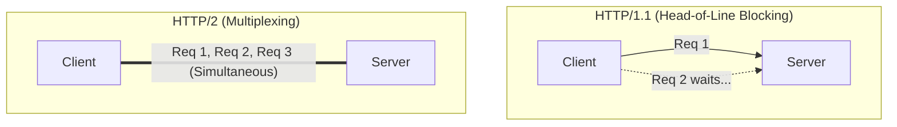

# 🚀 RPC 01: The Evolution of Communication (REST ➡️ gRPC)

When you break a monolith into microservices, your blazing-fast in-memory function calls turn into slow, unreliable network calls. How services talk to each other is the most critical decision in distributed system design.

This note breaks down why REST isn't always enough, what RPC actually is, and how Google's **gRPC**, **Protocol Buffers**, and **HTTP/2** revolutionized internal microservice communication.

---

## 🐢 1. The Bottlenecks of REST & JSON

REST (Representational State Transfer) is the undisputed king of public APIs. It uses standard HTTP methods (`GET`, `POST`, `PUT`, `DELETE`) to interact with "Resources" via URLs.

### Why REST struggles with internal Microservices:
1. **The JSON Payload Tax:** JSON is a text-based, human-readable format. While easy to read, it's incredibly inefficient for machines. It requires heavy CPU cycles for string serialization and deserialization.
2. **Redundant Data (Fat Payloads):** If you send an array of 10,000 users, the key `"first_name"` is repeated 10,000 times in the JSON text!
3. **No Strict Contracts:** A REST API developer can change a response field from an `integer` to a `string` and the client won't know until it crashes in production.
4. **HTTP/1.1 Limitations:** Standard REST traditionally operates over HTTP/1.1, which suffers from network performance bottlenecks (more on this below).

---

## 📞 2. Enter RPC (Remote Procedure Call)

**RPC** flips the mental model. Instead of thinking about "Resources" (like fetching a `/user/123`), you think about "Actions" and "Methods". 

With RPC, you call a function on a remote server exactly as if it were a local function in your own codebase. The RPC framework completely hides the network complexity.

* **REST Style:** `POST /checkout` with a JSON payload.
* **RPC Style:** `paymentService.chargeCreditCard(amount, cardDetails)`

---

## ⚡ 3. gRPC and Protocol Buffers (The Google Standard)

Google had thousands of microservices and realized REST was simply too slow and bloated. They built a highly efficient internal RPC framework called "Stubby", which they eventually open-sourced as **gRPC**.

gRPC introduces two massive architectural upgrades:

### A. Protocol Buffers (Protobuf)
Instead of JSON, gRPC uses Protobuf—a language-agnostic **binary serialization format**.
* **Lightning Fast & Tiny:** Instead of sending string keys like `"username": "tharun"`, Protobuf assigns a tiny integer tag to the field (e.g., `1`). The payload is compiled into raw binary zeros and ones. It is significantly smaller and faster to parse than JSON.
* **Contract-First Design:** Both client and server agree on a strict `.proto` file. You generate the code (in Java, Go, Python, etc.) directly from this file. If the contract breaks, your code won't even compile!

### B. Supported Streaming Modes
Because it uses HTTP/2, gRPC supports complex communication flows beyond simple Request-Response:
1. **Unary:** Standard (1 Request ➡️ 1 Response)
2. **Server Streaming:** (1 Request ➡️ Stream of Responses) e.g., Live stock ticker updates.
3. **Client Streaming:** (Stream of Requests ➡️ 1 Response) e.g., Uploading a massive file in chunks.
4. **Bidirectional Streaming:** (Stream ➡️ Stream) e.g., Real-time chat application.

---

## 🚄 4. The Engine: HTTP/1.1 vs. HTTP/2

You cannot truly understand gRPC without understanding why it *requires* HTTP/2.

### 🛑 The Problem with HTTP/1.1
* **Head-of-Line Blocking:** In HTTP/1.1, if you send 3 requests over a single TCP connection, Request 2 must wait for Request 1 to finish. (Like a single-lane highway where one slow car blocks everyone).
* **Heavy Headers:** Headers are sent as plain text repeatedly on every single request, wasting bandwidth.

### 🟢 The HTTP/2 Solution
* **Multiplexing:** HTTP/2 breaks data into binary frames. Multiple requests and responses can be sent and received simultaneously over a **single TCP connection** without blocking each other. (Like a multi-lane superhighway).
* **Binary Framing:** Data is transmitted in binary, making it extremely efficient to parse.
* **Header Compression (HPACK):** Headers are compressed, drastically reducing the overall payload size over the network.
* **Server Push:** The server can proactively send data to the client before the client even asks for it.

---

## ⚖️ 5. REST vs. gRPC: When to use which?

| Feature | REST | gRPC |
| :--- | :--- | :--- |
| **Data Format** | JSON (Text, Human Readable) | Protocol Buffers (Binary, Machine Optimized) |
| **Protocol** | Usually HTTP/1.1 | Strictly HTTP/2 |
| **API Contract** | Optional (OpenAPI/Swagger) | Mandatory Strict Contract (`.proto` file) |
| **Performance** | Moderate (Fat payloads, CPU heavy) | Ultra-Fast (Tiny payloads, low latency) |
| **Use Case** | **Web Integration:** Public-facing APIs, Browser clients (Browsers don't natively support gRPC's low-level HTTP/2 requirements yet). | **Microservices:** Internal service-to-service communication where speed, low latency, and strict contracts are critical. |

---
**🔗 Summary:**
While REST remains the gold standard for ease of use, web accessibility, and public endpoints, **gRPC** provides a robust, high-speed alternative optimized specifically for internal distributed systems.
